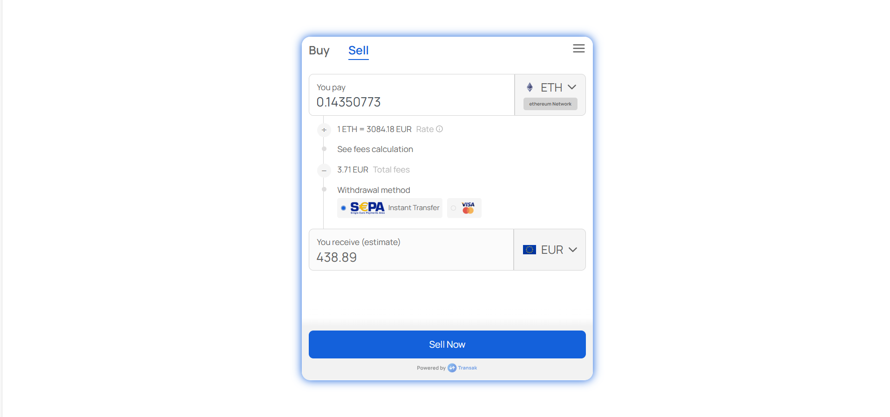

# Getting Started

# Project Overview 

Blockchain SDK with Transak in Next.js
This project is a Next.js application that integrates a blockchain SDK and Transak for managing cryptocurrency transactions. The platform allows users to perform crypto transactions easily, using Transak’s fiat-to-crypto on-ramp solution.

## Prerequisites
- Node.js and yarn/bun installed
- NextJS
- Tailwind CSS
- Transak

## Setup
1.	Clone the Repository:
git clone https://github.com/chmajidnaeem/blockchain-bitcoin
2.	Install Dependencies: npm install
3.	Run the Development Server:
4.	View the Application:
Open http://localhost:3000 in your browser to see the application in action.

🔧 Commands
•	Development: npm run dev
🛠 Technology Stack
•	Next.js for server-side rendering
•	TypeScript for type safety and improved tooling
•	Tailwind CSS for responsive and efficient styling